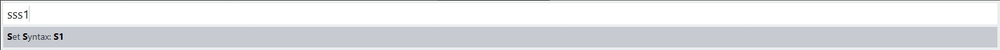
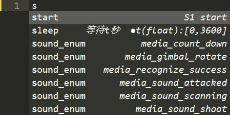
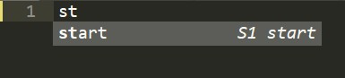
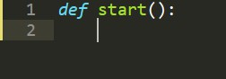
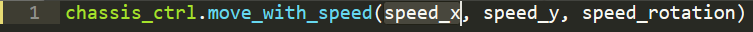
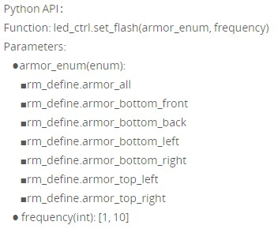
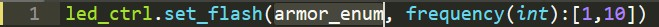
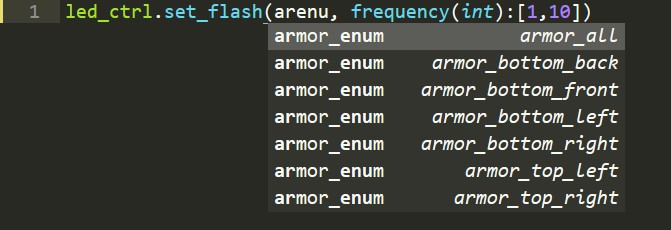

大疆推出了S1教育机器人，正因其教育定位，所以S1同时提供对Scratch和Python的支持。Scratch是MIT开发的面向中小学生编程教育的可视化平台，功能十分强大；但是对于高中生、大学生甚至创客团体，可能Python是更常见的选择。

由于目前大疆开发团队还没有给出独立的SDK(软件开发环境)，而app实验室里的编辑器功能又比较有限。因此，我想搭建一个自由、可拓展的开发环境。首先选择的编辑器是Sublime，一款轻量、强大的文本编辑器；通过插件功能，我可以拓展他的功能（例如大家最喜欢的代码补全). 

[EasyS1](https://github.com/sunjiawe/RoboMaster-Easy-S1)是专门为S1开发的一款插件，目前支持的功能有：

* 函数补全
* 函数参数查询(各种enum类型)
* 跳转官网、论坛的链接

Tips：由于没有app的后台接口，与S1机器人的通信、上传程序无法实现；因此，编辑好的代码还是需要手工复制到app里，进行程序上传

# EasyS1

EasyS1是 [Sublime Text](http://www.sublimetext.com) 的一款插件，提供编辑S1 python代码的编程环境。插件是孙佳伟在2019年写的，如果你有任何想法或建议，欢迎发送邮件到我的[email](727233543@qq.com). 谢谢~

### 准备工作
[Sublime Text](http://www.sublimetext.com) 3.0：一款轻量、强大的文本编辑器

### 安装 S1插件

1. 从[github](https://github.com/sunjiawe/RoboMaster-Easy-S1)下载 .zip压缩包
2. 解压zip文件，拷贝到SublimeText的Packages目录(Preferences菜单->Broswe Packages)

# 说明文档

## 新建脚本

1.用Sublime新建一个.py文件，并打开

2.首先将语法设为S1(继承自python)

ctrl + shift + P调出控制台，然后输入："sss1" (Set Syntax S1的缩写)

## 函数补全

代码补全：指用户在输入一个字符串的部分内容时，就提供下拉菜单自动推荐相关常用字符串供用户选择以快速输入的一项功能特性。随着输入字母越多，可选的范围逐渐缩小。

### start()

例如，最外层的start框架，可以输入s  (会出现所有s开头的代码段，键盘上下键可以自由选择)

紧接着再输入一个t，则范围只缩小到start函数(因为只有它以"st"开头)：

输入"回车键"或两次"Tab"键，可以确认选中的代码片段：

## 模块

目前S1官方提供的有以下模块：

* robot_ctrl：机器人运动模式
* gimbal_ctrl：控制云台
* chassis_ctrl：控制底盘
* armor_ctrl：控制装甲板
* gun_ctrl：控制发射器
* led_ctrl：控制LED
* vision_ctrl：视觉系统
* media_ctrl：媒体系统(相机、扬声器)

输入这些模块的前几个字母，就会列出该模块提供的所有函数：

右边带有关于相关函数及函数参数的说明

**注意**：中间不要输入`.`  不然会打断自动补全的解析

我比较习惯的取缩写方法：

* 模块前几个字符 + 函数每个单次的首字母：例如 chacmwt       **cha**ssis_**c**trl.**m**ove\_**w**ith\_**t**ime
* 模块前几个字符 + 关键单次：例如  chacmove    ==>找出所有与移动有关的函数

### 带参数函数

"chassis_ctrl"函数通过设定x、y和旋转三个速度分量，来控制机器人运动

因此补全函数后，还需要输入3个函数函数参数：

光标会自动跳到第1个参数的位置，键盘直接输入 速度数值即可

输入完第一个参数，按Tab键，会跳到第2个参数的位置；依次输入完3个参数，再按Tab跳到函数结尾，以进行后续代码的编写

## enum变量

enum是枚举量，本质就是常数。如果我需要通过改变某个参数来控制函数以不同的模式做事情，最简单的方法就是：用数字1代表模式a，用数字2代表模式b...

可是以上的方法不具备可读性，很长时间以后，可能连你自己也忘记了当初定义的1代表什么？我们可以使用额外的字符串来代替数字命名的方式。

所以，RM给出的API中有大量的enum变量

例如led_ctrl.set_flash()可以指定任意位置的LED闪烁频率，机器人上前后左右装甲板、云台左右装甲板都有LED，因此我们需要用不同的标记命名这些位置，以此让函数可以调用。

以上的armor_enum就是提过的"枚举量"，有7种可选的取值：分别代表6个独立的位置 和 "所有位置"，供7种配置

虽然，枚举量增加了代码的可读性。但是并没有降低我们编程时的记忆量，我们仍然需要记住全部的字符串。RM S1插件，可以帮助你快速输入enum枚举量。

输入ledcsf(部分缩写，只要按循序即可)，通过代码补全选择set_flash()函数

这是第一个参数的名称，告诉我们枚举量的名字是"armor_enum"，我们只需要原地重新输入一遍armor_enum即可(使用部分缩写也可以)

这里我输入arenu，补全列表中就出现了7中可选的模式，根据自己的需求选择即可(键盘方向键).

### License

Copyright [2019] [Sun Jiawei/孙佳伟] <727233543@qq.com>

Licensed under the Apache License, Version 2.0 (the "License");
you may not use this file except in compliance with the License.
You may obtain a copy of the License at

    http://www.apache.org/licenses/LICENSE-2.0

Unless required by applicable law or agreed to in writing, software
distributed under the License is distributed on an "AS IS" BASIS,
WITHOUT WARRANTIES OR CONDITIONS OF ANY KIND, either express or implied.
See the License for the specific language governing permissions and
limitations under the License.